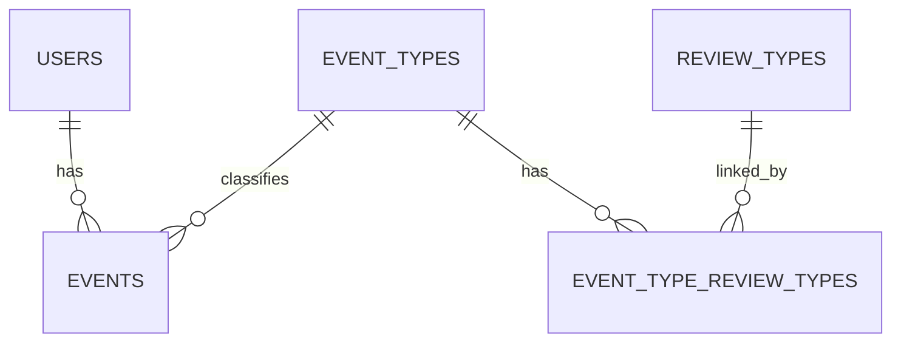

# RISEN Data Model

Version: 0.1  
Status: Draft

---

# 1. Purpose

この文書は、RISEN Observation Platform の主要データモデルを定義する。

RISENでは、すべての記録を直接AIに渡すのではなく、  
共通形式である Observation として保存し、Knowledge Layer で意味付けする。

---

# 2. Core Concept

```
User
  ↓
Observation(events)
  ↓
Event Type
  ↓
Mapper
  ↓
Review
  ↓
AI / Dashboard / Administration
```

---

# 3. Core Tables

## users

利用者マスター。

主な項目：

- id
- user_code
- name
- kana
- birth_date
- gender
- facility_id
- active
- source_system
- source_record_id

役割：

- 利用者を一意に識別する
- Google SpreadsheetやCSVから同期される
- events.user_id と紐づく

---

## events

Observation本体。

主な項目：

- id
- user_id
- event_type_id
- event_datetime
- summary
- memo
- source
- source_system
- source_record_id
- status
- facility_id
- staff_id
- location
- import_batch_id
- created_at
- updated_at

役割：

- 日常記録・支援記録・CSVから生成されるObservationを保存する
- source_record_id により重複取込を防止する
- event_type_id により意味付けされる

---

## event_types

RISEN標準イベント分類。

例：

- 睡眠
- 食事
- 水分
- 排泄
- 清潔
- 所在確認
- 事故・ヒヤリハット
- 身体拘束・行動制限レビュー

主な項目：

- id
- category
- name
- sort_order
- active

役割：

- Observationの意味を定義する
- event_mapper の変換先となる
- AI・集計・行政レビューの基準となる

---

## event_mapper

現場表現をRISEN標準event_typeへ変換する辞書。

例：

```
歯磨き → 清潔
就寝 → 睡眠
廊下 → 所在確認
拘束着 → 身体拘束・行動制限レビュー
```

主な項目：

- id
- facility_name
- keyword
- event_type_name
- priority
- active
- created_at

役割：

- 施設ごとの表現差を吸収する
- コード変更なしで分類ルールを変更できる
- 未分類イベントを減らし、Knowledge化を進める

---

## review_types

行政・委員会・専門職レビューの種類。

例：

- 権利擁護レビュー
- 事故レビュー
- 医療レビュー
- 委員会レビュー

主な項目：

- id
- name
- description
- active
- created_at

役割：

- Observationを通常分析とレビュー対象に分ける
- 行政対応・委員会資料・AIレビューに利用する

---

## event_type_review_types

event_type と review_type の中間テーブル。

主な項目：

- id
- event_type_id
- review_type_id
- priority
- active
- created_at

役割：

- 1つのevent_typeに複数のreview_typeを紐づける
- 例：転倒 → 事故レビュー + 医療レビュー
- 例：身体拘束 → 権利擁護レビュー + 委員会レビュー

---

# 4. Relationship Overview



---

# 5. Import Model

RISENでは、外部データを直接AIに渡さない。

```
CSV / Google Spreadsheet
        ↓
Mapper
        ↓
events
        ↓
Knowledge Layer
```

現在の主な入力：

- 利用者台帳
- 日常記録
- 支援記録
- 会議記録

---

# 6. Upsert Policy

## users

`user_code` を基準にUpsertする。

目的：

- 同じ利用者を重複登録しない
- 利用者台帳を更新しても同じレコードを維持する

---

## events

`source_record_id` を基準にUpsertする。

目的：

- 同じCSVやスプレッドシートを再同期しても重複しない
- event_type_id や mapper変更後の再分類を可能にする

---

# 7. Mapper Policy

event_mapper はコードではなくデータとして管理する。

分類ルールは次の優先順位で適用する。

1. active = true
2. priority 昇順
3. keyword が summary または memo に含まれる

---

# 8. Administrative Review Policy

行政・監査上の意味を持つ記録は、通常分類に丸めない。

例：

```
拘束着
身体拘束
ミトン
ベッド柵
```

これらは

```
身体拘束・行動制限レビュー
```

へ分類し、review_types と紐づける。

---

# 9. Future Tables

今後追加予定：

## locations

- id
- facility_id
- name
- building
- floor
- zone
- active

用途：

- 食堂、居室、廊下、浴室などを標準化する

---

## tags

- id
- name
- category
- active

用途：

- 全介助
- 一部介助
- 見守り
- 拒否
- 本人希望

---

## event_tags

- event_id
- tag_id

用途：

- Observationへ複数タグを付与する

---

## risk_levels

- id
- name
- score
- description

用途：

- AIリスク判定
- ダッシュボード表示
- 行政レビュー優先度

---

# 10. Design Principles

RISENのデータモデルは以下を原則とする。

- Observationを中心に設計する
- 施設差分はMapperで吸収する
- 行政・委員会視点はReview Modelで管理する
- AIは生データではなくKnowledge化されたObservationを扱う
- コード変更ではなくマスター更新で運用できる構造にする

---

# 11. Current Status

| Table | Status |
|---|---|
| users | Implemented |
| events | Implemented |
| event_types | Implemented |
| event_mapper | Implemented |
| review_types | Implemented |
| event_type_review_types | Implemented |
| locations | Planned |
| tags | Planned |
| risk_levels | Planned |

---

# 12. Next Step

次に整備するデータモデル：

1. locations
2. tags
3. event_tags
4. review workflow
5. AI mapper suggestions
